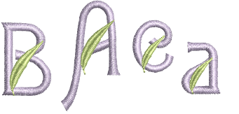
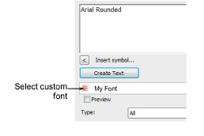

# Select custom fonts

|  | Right-click Toolbox > Lettering to select a custom font. |
| ------------------------------------------------ | -------------------------------------------------------- |

To use a custom font, select it like any other font. If a letter has a multi-character name, you can only access it from the Lettering dialog using the special tilde (\~) symbol.

## To select custom fonts...

1. Right-click the Lettering icon to access object properties.

2. Select a custom font from the droplist.

3. Enter the names of the letters you want to use in the text box.

- If the letter name is a single character – e.g. ‘A’ – enter that character.
- If the letter name consists of more than one character – e.g. ‘Star’ – enter a tilde (\~) followed by the letter name.

Tip: Combine letters that use single or multiple characters in their name by prefacing the single character with two tildes – e.g. \~Star\~\~A\~Star.

4. Set the formatting values as you would for other lettering objects.

## Related topics...

- [Manage fonts](Manage_fonts)
