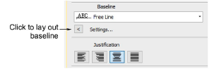
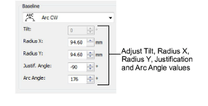
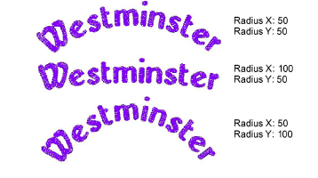
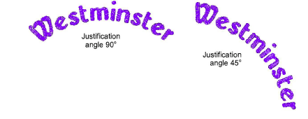
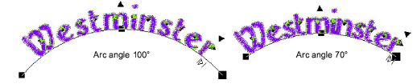
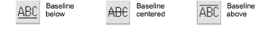

# Adjust curved baseline settings

|  | Use Toolbox > Lettering to adjust baseline settings. |
| ------------------------------------------------ | ---------------------------------------------------- |

Adjust baseline settings for more precise numeric control over radius (X and Y), as well as tilt, justification, and arc angles.

## To adjust curved baseline settings...

1. Double-click a selected lettering object/s to access object properties.

2. Click Settings. The Baseline Settings dialog opens. Options depend on baseline type.

3. Select a circle or arc baseline type from the list. The Tilt, Radius X, Radius Y, Justification Angle and Arc Angle fields are activated.

4. Adjust these values as required:

- Radius X: default radius of the baseline arc (X-axis).
- Radius Y: default radius of the baseline arc (Y-axis).

- Tilt: angle of the baseline relative to the horizontal axis.

::: info Note
The Tilt field is activated when Radius X and Radius Y values are different.
:::

- Justification Angle: angle of the vertical axis through the lettering object relative to the horizontal axis.

- Arc Angle: angle between radii connecting ends of baseline to center of arc. This constrains the baseline so the text falls within the arc specified.

::: tip
Precise control over baseline width is important when combined with Team Names when you want to ensure all names fit within the same area such as a pocket. A fixed width on arch baselines can be set by adjusting Arch Angle value in the Baseline panel.
:::

5. Select a baseline position.

When digitizing lettering for a badge, for example:

- For lettering above, select a clockwise circle or arc with baseline below.
- For lettering below, select a counterclockwise circle or arc with baseline above.
- For horizontal lettering through the middle of the badge, select a fixed line with baseline centered.

6. For fixed-line baselines, select an ‘auto-frame’ style.

7. Specify the letter, word and line spacing as required.

8. Select a letter orientation.

9. Click OK to return to Object Properties > Special > Lettering docker.

## Related topics...

- [Adjust fixed-width baseline settings](Adjust_fixed-width_baseline_settings)
- [Adjust letter spacings on-screen](../lettering_create/Adjust_letter_spacings_on-screen)
- [Adjusting baselines](Adjusting_baselines)
- [Creating simple teamname designs](../lettering_names/Creating_simple_teamname_designs)
