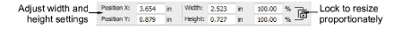
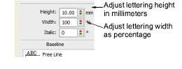

# Adjust dimensions

|  | Use Toolbox > Lettering to adjust letter height and width. |
| ------------------------------------------------ | ---------------------------------------------------------- |

You can [scale](../../glossary/glossary) lettering objects vertically, horizontally and proportionally using the general properties or via the Special tab of the Object Properties docker.

## To adjust dimensions...

- Select the lettering object. The current dimensions appear in the Property Bar.

- Adjust width and height settings either as absolute values (mm) or as a percentage of current settings.
- Press Enter.

- Alternatively, double-click the lettering object to access object properties.

- In the Height field enter the height of your lettering object in millimeters.
- Enter the width of your lettering object in the Width field as a percentage of the height.
- For wide letters, increase the percentage – e.g. 140%.
- For narrow letters, decrease the percentage – e.g. 70%.

Note: Letter height can vary between roughly 5mm and 200 mm. For recommended sizes, see [Standard Fonts](../../Management/sample_fonts/Standard_Fonts).

## Related topics...

- [Transforming Objects](../../Modifying/transform/Transforming_Objects)
- [Reshaping Objects](../../Modifying/reshape/Reshaping_Objects)
