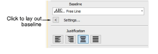
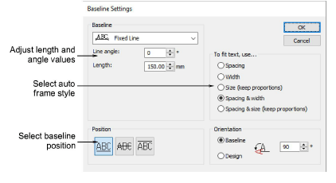
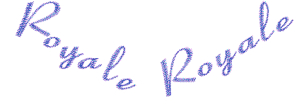
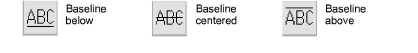

# Adjust fixed-width baseline settings

|  | Use Toolbox > Lettering to adjust baseline settings. |
| ------------------------------------------------ | ---------------------------------------------------- |

A free-line baseline does not have a fixed or pre-determined length – the baseline extends as long as you keep adding letters. A fixed-line baseline has a fixed length which you can digitize or specify numerically. Various options are available to handle text that extends beyond the baseline.

::: tip
Precise control over baseline width is important when combined with Team Names when you want to ensure all names fit within the same area such as a pocket.
:::

## To adjust fixed-width baseline settings...

1. Double-click a selected lettering object/s to access object properties.

2. Click Settings. The Baseline Settings dialog opens. Options depend on baseline type.

3. Select a horizontal, vertical, or arc baseline from the list.

4. Adjust the Length value as required.

Fixed-line baselines allow control over line length as well as options for handling text which does not fit the baseline. This is particularly useful for multiple ‘team’ names. Free-line baselines only allow you to adjust the Line Angle value.

5. For fixed-line baselines, select an ‘auto-frame’ style:

- Spacing: Letter size and width stays the same and letters are spaced evenly along the baseline. Letters may overlap if the text is too wide.

- Width: The width of each letter is reduced and the original spacing kept.

- Size (Keep Proportions): Letter width and height is reduced proportionally but the original spacing remains.

- Spacing and Width: Letter width and spacing is reduced.

- Spacing and Size (Keep Proportions): Letter width, height and spacing is reduced proportionally.

6. Adjust the Line Angle as required. Enter the exact angle of baseline to the horizontal axis.

7. Select a baseline position.

When creating lettering for a badge, for example:

- For lettering above the badge, select a baseline below.
- For lettering below the badge, select a baseline above.
- For horizontal lettering through the middle of the badge, select a centered baseline.

8. Specify the letter, word and line spacing as required.

9. Select a letter orientation.

10. Click OK to return to Object Properties > Special.

## Related topics...

- [Apply baselines](../lettering_create/Apply_baselines)
- [Adjust spacing settings](../lettering_create/Adjust_spacing_settings)
- [Adjusting baselines](Adjusting_baselines)
- [Creating simple teamname designs](../lettering_names/Creating_simple_teamname_designs)
