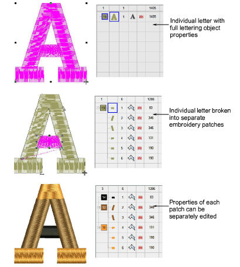

# Breaking apart lettering

|  | Use Edit > Break Apart to split composite objects – monograms, appliqués, lettering, etc – into component objects. |
| ---------------------------------------- | ------------------------------------------------------------------------------------------------------------------ |

Applying the Break Apart function to a lettering object breaks it into a logical stitching sequence while maintaining lettering object characteristics. Object properties can be edited separately for single lines, single words, or even single characters. Stitching sequence is maintained.

Sequence logic is as follows:

- Multi-line lettering can be broken into separate objects per line
- Individual lines can be broken into separate objects per word
- Words can be broken into separate objects per letter
- Letters can be broken into their individual embroidery patches. Lettering properties are lost. Only general embroidery object properties remain.

Tip: An exception for single-line (multi-word) objects is the case of the center-out stitching sequence. Such objects are broken apart directly into single-letter objects. The stitching sequence is thereby preserved.

## Related topics...

- [Break apart composite objects](../../Modifying/reshape/Break_apart_composite_objects)
