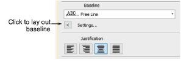

# Change letter orientation

You can define the rotation angle of letters relative to the baseline or the design itself. The latter lets you keep letters vertical regardless of baseline angle in order to achieve a ‘staircase effect’.

## To change letter orientation...

1. Right-click the Lettering icon or double-click selected lettering object/s to access object properties.

2. Click Settings to open the Baseline Settings dialog.

3. Select an Orientation setting.

- Baseline: orients letters relative to the lettering baseline.
- Design: orients letters relative to the horizontal.

4. Enter an orientation angle.

5. Click OK to return to Object Properties > Special > Lettering docker.
