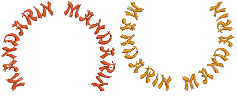

# Editing Embroidery Lettering

EmbroideryStudio gives you interactive and precise numeric control over many settings affecting lettering objects. Adjust both individual letters and lettering objects as a whole. Apply horizontal, vertical, and curved baselines. Modify baseline type, length, radius and angle, as well as position. You can even define the rotation angle of letters relative to the baseline or the design itself.

This section describes how to edit lettering text. It also explains how to scale and transform lettering objects. It also covers adjusting individual letters as well as reshaping baselines on screen.

## Related topics...

- [Editing text](Editing_text)
- [Modifying lettering](Modifying_lettering)
- [Adjusting individual letters](Adjusting_individual_letters)
- [Adjusting baselines](Adjusting_baselines)
- [Breaking apart lettering](Breaking_apart_lettering)
