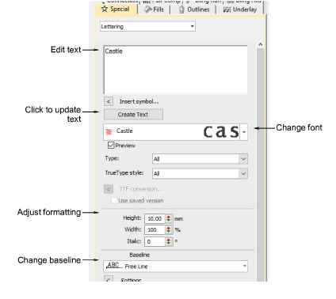

# Editing text

|  | Use Toolbox > Lettering to edit lettering on screen. |
| -------------------------------------- | ---------------------------------------------------- |

When you have created a lettering object, you can select it and make changes to it interactively or by adjusting object properties.

## To edit text...

- Click Lettering and then click inside the lettering object. An I-beam appears.

- Edit the text as required. The lettering shows its wireframe.
- Press Shift+Enter to start a new line. Press Enter to complete.
- Alternatively, double-click the lettering object. The Object Properties > Special > Lettering docker opens.

- Edit the text in the text entry panel and make any other adjustments you require.
- Click the Update Text button.

## Related topics...

- [Format lettering](../lettering_create/Format_lettering)
- [Applying stitch types & effects to lettering](../lettering_advanced/Applying_stitch_types_effects_to_lettering)
