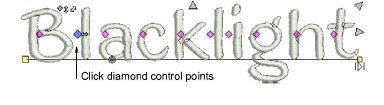
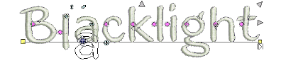

# Reposition letters

|  | Use Reshape > Reshape Object to reposition individual letters on screen. |
| -------------------------------------------------------- | ------------------------------------------------------------------------ |

You can reposition individual letters in a lettering object using the Reshape Object tool.

## To reposition letters...

1. Select the lettering object and click Reshape Object.

2. Click the diamond control point.

To select multiple letters, hold down Ctrl or Shift as you select.

3. Click-and-drag the letter/s to the new position:

- To move horizontally, drag along the baseline.
- To move vertically, hold down Shift as you drag.
- To move the letter freely, hold down Ctrl as you drag.

4. Release the mouse to complete and press Esc.

## Related topics...

- [Adjust letter spacings on-screen](../lettering_create/Adjust_letter_spacings_on-screen)
