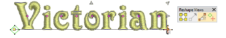
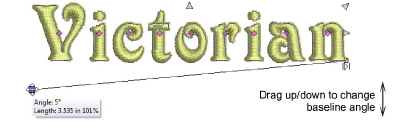
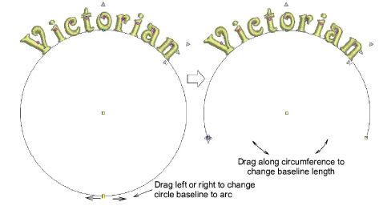
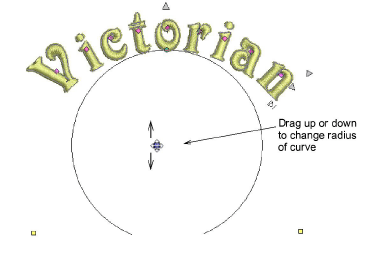
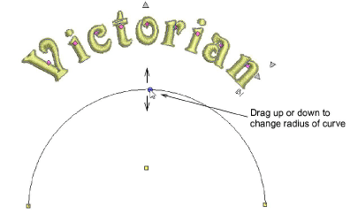
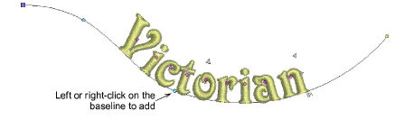
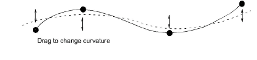

# Reshape baselines interactively

|  | Use Reshape > Reshape Object to reshape lettering baselines. |
| -------------------------------------------------------- | ------------------------------------------------------------ |

Baselines can be adjusted with the Reshape Object tool. Depending on baseline type, you can adjust angles, lengths, and sizes. You can change curve radii and justification points. You can completely reshape Any Shape baselines.

## To reshape a baseline interactively...

1. Select the lettering object and click Reshape Object.

::: tip
The large diamond and cross represent start and end points. Toggle them off to access baseline controls.
:::

- Change angles of straight baselines by dragging square control points at either end.

- Create an arc baseline from a circular one by dragging the hollow square control point.

- Change lettering orientation of arc baselines by dragging the solid square control points at either end.

::: tip
Letter positions depend on justification – left, center, right or justified. If the baseline becomes too short, letters may overlap.
:::

- Change the radius by dragging the solid square control point in the center of the circle.

- Alternatively, change the radius by dragging the control point in the center of the baseline.

- Adjust Any Shape baselines by adding, deleting, changing or moving reference points like any embroidery object.

- To reshape, left-click to bend the line at an angle, right-click to bend into a curve.
- To re-position, drag any one of the baseline control points up or down.

- To delete, select a control point and press Delete.
- To change straight to curve, or curve to straight, select the control point and press Spacebar.
- Press Esc to finish.

## Related topics...

- [Adjust fixed-width baseline settings](Adjust_fixed-width_baseline_settings)
- [Adjust curved baseline settings](Adjust_curved_baseline_settings)
- [Reshape letters](Reshape_letters)
- [Reshaping embroidery objects](../../Modifying/reshape/Reshaping_embroidery_objects)
