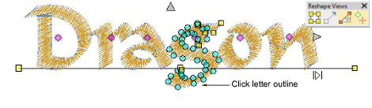
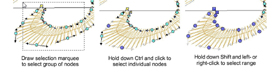

# Reshape letters

|  | Use Reshape > Reshape Object to reshape individual letters on screen. |
| -------------------------------------------------------- | --------------------------------------------------------------------- |

Create special lettering effects by reshaping letter outlines with the Reshape Object tool.

## To reshape letters...

1Select the lettering object and click Reshape Object.

2Click the letter outline. Control points appear around the outline. Selectively turn off control points as required.

3Select reshape nodes by any of the following means:

- Drag a [selection marquee](../../glossary/glossary) around the reshape nodes you require.
- To select multiple nodes, hold down Ctrl or Shift as you select.

4Reshape the letter like any other object and press Enter.

Tip: Press Spacebar to toggle between selected corner and curve reshape-nodes.

5Adjust stitch angles as required and press Enter.

Tip: Holding down the Ctrl key, click the outline wherever you want to place an additional stitch angle.

6Adjust entry/exit points as required and press Enter.

7Press Esc to finish.

Note: Custom fonts are saved in ESA format to in the USERLETW folder within the local EmbroideryStudio installation. If you want to adjust converted characters or add special characters to a custom font, you can do so via the Create Letter function.

## Related topics...

- [Adjusting stitch angles](../../Quality/quality/Adjusting_stitch_angles)
- [Smoothing curves](../../Automatic/vectors/Smoothing_curves)
- [Reshaping embroidery objects](../../Modifying/reshape/Reshaping_embroidery_objects)
- [Create custom letters](../lettering_custom/Create_custom_letters)
- [Save custom letters](../lettering_custom/Save_custom_letters)
