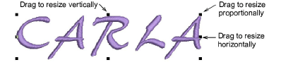
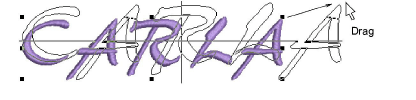
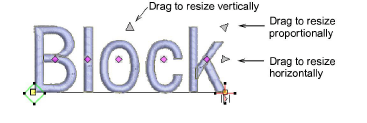
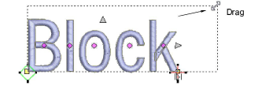

# Scale lettering

|    | Use Select > Select Object to scale lettering objects on screen.   |
| ---------------------------------------------- | ------------------------------------------------------------------ |
|  | Use Reshape > Reshape Object to scale lettering objects on screen. |

You can [scale](../../glossary/glossary) your lettering objects vertically, horizontally and proportionally with the Select Object tool. You can [scale](../../glossary/glossary) your lettering objects vertically, horizontally and proportionally with the Reshape Object tool.

## To scale lettering...

- Click Select Object and select the lettering object.

- Click-and-drag one of the selection handles to resize the object horizontally, vertically or proportionally.

- Alternatively, click Reshape Object.

- Click-and-drag one of the dark triangular control points to resize the object horizontally, vertically or proportionally.

- Release the mouse to complete and press Esc.

## Related topics...

- [Transforming Objects](../../Modifying/transform/Transforming_Objects)
- [Reshaping Objects](../../Modifying/reshape/Reshaping_Objects)
