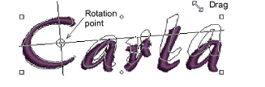

# Transform lettering

|    | Use Select > Select Object to transform lettering objects on screen. |
| -------------------------------------------------------- | -------------------------------------------------------------------- |
|  | Use Reshape > Reshape Object to rotate lettering objects on screen.  |

Apart from [scaling](../../glossary/glossary), you can use the Select Object and Reshape Object tools to skew and rotate lettering objects.

## To transform lettering...

- Click Select Object and select the lettering object.
- Click the lettering object again. Another set of control points appears. These let you rotate and skew the lettering object.

- Click-and-drag diamond-shaped control points to skew the lettering object.

- Click-and-drag hollow square control points to rotate the lettering object.

- Click-and-drag the rotation point itself to a new position before rotating.

- Alternatively, click Reshape Object.

- Click-and-drag up or down one of the solid square control points on the baseline to slant the lettering object.

- Release the mouse to complete and press Esc.

## Related topics...

- [Transforming Objects](../../Modifying/transform/Transforming_Objects)
- [Reshaping Objects](../../Modifying/reshape/Reshaping_Objects)
