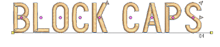
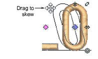

# Transform letters

|  | Use Reshape > Reshape Object to transform individual letters on screen. |
| -------------------------------------------------------- | ----------------------------------------------------------------------- |

You can transform individual letters by manipulating control points on screen with the Reshape Object tool.

## To transform letters...

1Select the lettering object and click Reshape Object.

2Click the diamond control point. Another set of reshape nodes appear around the letter.

3Click-and-drag a reshape node around the letter to transform it.

4Press Esc to finish.

