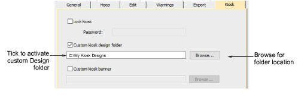

# Change design location

|  | Use Standard > Options to access application options for kiosk and other settings. |
| -------------------------------------------- | ---------------------------------------------------------------------------------- |

The default kiosk design folder is located within the EmbroideryStudio e4 folder structure. This may not be convenient for you if you are dealing with numbers of custom designs. You can easily change the folder location to any on your kiosk hard drive or network. If you have more than one kiosk set up, they can all reference the same design folder.

## To change the design location...

- Click the Options icon or select Setup > Options. Click the Kiosk tab.

- Tick the Custom kiosk design folder option and browse for the folder on your local drive or network. This then becomes the default kiosk design folder. Any EMB designs kept in this location will appear in the kiosk design chooser.
