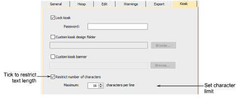
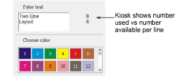

# Configure kiosk character count limits

|  | Use Standard > Options to access application options for kiosk and other settings. |
| -------------------------------------------- | ---------------------------------------------------------------------------------- |

Different scenarios may lead to variations in the number of characters allowed. The commercial requirement is for 16 characters per line, but the software allows you to change that limit. For example, maximum characters when buying online may be limited to 10, while baby-size caps may be less than 16\. Optionally, the supervisor can limit the number of characters allowed in kiosk mode.

::: info Note
Spaces between words count as characters. However, extra spaces are allowed at the start and end of a line without compromising the character count.
:::

## To configure the kiosk character count limit...

- Click the Options icon or select Setup > Options. Click the Kiosk tab.

- Tick the Restrict number of characters option and set the maximum number of characters – e.g. 16.

When the number of characters is limited by this option, the kiosk shows the number used vs the number available – e.g. ‘5 / 16’. Where a two-line design is selected, the limit is shown for each line.

## Related topics...

- [Troubleshooting long descenders](Troubleshooting_long_descenders)
