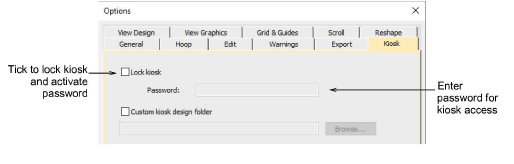
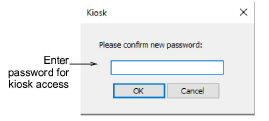
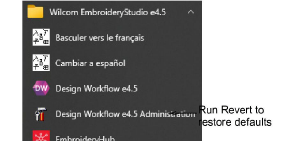

# Create kiosk passwords

|  | Use Standard > Options to access application options for kiosk and other settings. |
| ---------------------------------- | ---------------------------------------------------------------------------------- |

Supervisors can lock the kiosk to protect against unauthorized use. They can later temporarily unlock the kiosk in order to edit designs or change other settings.

## To create a password for the kiosk...

1Click the Options icon or select Setup > Options. Click the Kiosk tab.

2Enter a secure password and click OK.

3Select Window > Kiosk start the kiosk. You will be prompted to enter the password.

Note: You can return to Options dialog at any time to change or remove password protection. If you forget the password, you will need to run the Revert program from the EmbroideryStudio program group to restore factory defaults.

