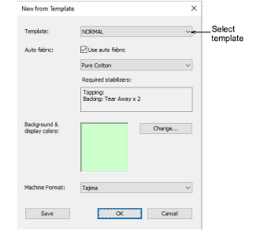
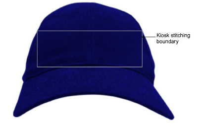
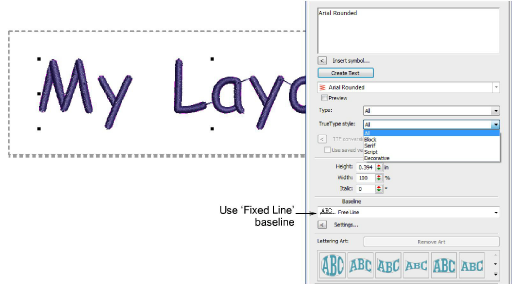
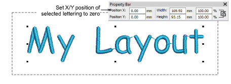

# Create layouts based on templates

|              | Use Toolbox > Lettering to create embroidery lettering directly on-screen. Right-click to access settings.                                |
| -------------------------------------------------- | ----------------------------------------------------------------------------------------------------------------------------------------- |
|  | Use View > Auto Start & End to toggle function on/off according to the current settings. Right-click to open the Auto Start & End dialog. |

Alternatively, you have access to complete EmbroideryStudio capabilities to create designs from scratch. Onscreen help is provided via the Help menu.

## To create a layout based on a template...

- If you are creating a design from scratch, use the File > New from Template command.

- Select a kiosk template if you have set one up. For example, you may set up your template to include a stitching boundary defining the area to work within, say, for cap designs. This can be drawn in CorelDRAW Graphics. You might also want to include a product image.

- Select the Lettering tool and create the text you require. Adjust settings such as font, dimensions, etc.

::: info Note
To ensure that text remains within the allowable boundary, it is safest to use the Fixed Line baseline.
:::

- Change thread color as desired.

- Set the lettering object position to zero (0,0) as shown. This will ensure that the lettering layout automatically centers itself in the allowable stitching area.
- When you are happy with the result, click Save.

The file must be saved to the EmbroideryStudio e4 Designs folder:

C:\\Program Files\\Wilcom\\EmbroideryStudio_e4.0\\Kiosk\\Designs

Alternatively, set your own designs folder.

- The design will appear in the kiosk design chooser when you next run it.

## Related topics...

- [Set up thread colors](Set_up_thread_colors)
- [Change design location](Change_design_location)
