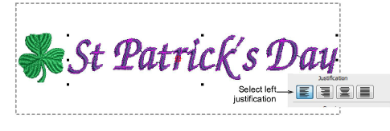

# Create layouts with included design motifs

|      | Use Toolbox > Lettering to create embroidery lettering directly on-screen. Right-click to access settings. |
| ---------------------------------------------------- | ---------------------------------------------------------------------------------------------------------- |
|  | Click Standard > Import Embroidery to import embroidery design file into current design.                   |

For special occasions, you may want to create a kiosk layout which includes a special motif – for instance, St Patrick’s Day, with a Shamrock at the start of the lettering. These motifs need to be about the size of a capital letter. Together with the lettering, they need to fit within the allowable stitching boundary.

## To create a layout with an included design motif...

1. Create a layout from scratch or based on an existing layout. See above.

2. Import a suitable design motif using the Import Embroidery command. See main help system for details.

3. Place the motif and key in the default lettering.

4. Double-click the lettering and set left justification in Object Properties. Alternatively, if you place the motif on the right, set justification to right.

5. When you are happy with the result, click Save.

The file must be saved to the EmbroideryStudio e4 Designs folder:

C:\\Program Files\\Wilcom\\EmbroideryStudio_e4.0\\Kiosk\\Designs

Alternatively, set your own designs folder.

6. The design will appear in the kiosk design chooser when you next run it. The whole design, including motif and lettering, is auto-centered immediately after text is updated in kiosk mode.

## Related topics...

- [Change design location](Change_design_location)
