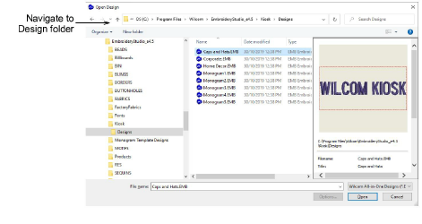
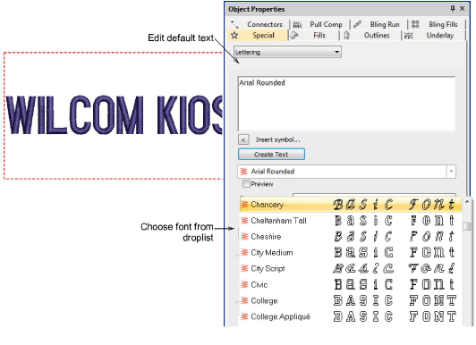

# Create new layouts from old

|              | Use Standard > Open to open an existing design.                                                |
| -------------------------------------------------- | ---------------------------------------------------------------------------------------------- |
|  | Use Standard > Save Design to save the current design. Right-click to open the Save As dialog. |

To create custom design layouts is not very different to setting up thread colors. The simplest approach is to base a new design on an existing one in order to preserve stitch settings and design scale. You can change colors, fonts and stitch settings as required.

## To create a new layout from an old one...

1. Click the Open icon. The Open Design dialog opens.

2. Navigate to the Designs folder of your EmbroideryStudio e4 installation:

C:\\Program Files\\Wilcom\\EmbroideryStudio_e4.0\\Kiosk\\Designs

Alternatively, specify your own folder.

3. Select a design to edit and click Open.

4. Before you do anything else, select File > Save As and save the design under a different name.

5. Double-click the design to open its properties.

6. Edit the default text and select an alternative font from the droplist as desired.

7. Click the Update Text button to view the result on screen.

8. Change default thread color as desired. The design will appear in the kiosk design chooser when you next run it.

## Related topics...

- [Change design location](Change_design_location)
