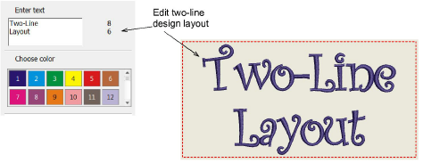

# Creating two-line lettering

Kiosk mode allows two-lines of text to be entered and edited. The text box in the control panel supports single- or multi-lines depending on the selected layout. Two-line layouts need to be predefined and saved to the designs folder. When using a multi-line layout, the first Enter keypress will create another line. The next will confirm text entry as for a single-line layout.

Note: If you switch design layouts, the system will attempt to preserve user-entered text between single- and multi- line designs. For example, switching from single to double, the original line of text will be copied to the first line. The second will be empty.
