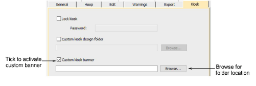
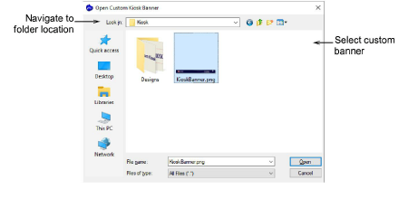

# Customize kiosk banners

|  | Use Standard > Options to access application options for kiosk and other settings. |
| -------------------------------------------- | ---------------------------------------------------------------------------------- |

Like the kiosk Design folder, the default kiosk banner is located within the EmbroideryStudio folder structure. If you want to modify the banner in any way – e.g. with a specific location name – it is a simple matter to access the banner and update it. Alternatively, you can copy the modified banner to a separate location on your kiosk hard disk or network location and reference it there. If you have more than one kiosk set up, they can all reference the same banner.

## To customize the kiosk banner...

1. Navigate to the ‘Kiosk’ folder of your EmbroideryStudio e4 installation:

C:\\Program Files\\Wilcom\\EmbroideryStudio_e4.0\\Kiosk\\

Here you will find the default kiosk banner – dimensions 1200 x 100 pixels.

2. Customize the banner as required:

- Either replace the current image with one of the same dimensions.
- Edit the current banner in any graphics or paint program and save to the same location.
- Copy the banner to the same or another location and edit as desired.

If you move the banner to another location, you need to update the software settings as follows:

3. Click the Options icon or select Setup > Options. Click the Kiosk tab.

4. Tick the Custom kiosk banner option and browse to the folder on your local drive or network.

5. Select the custom banner file and click Open. This then becomes the default banner which the kiosk will reference.
