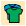
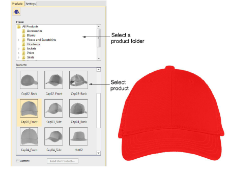
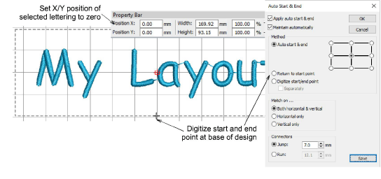
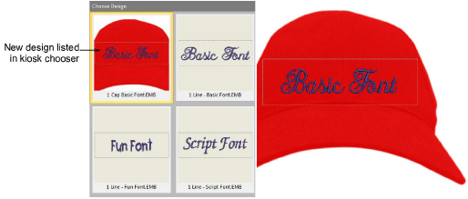

# Include design backdrops

|  | Use Color > Product Visualizer to choose a garment or product backdrop on which to position your decoration. |
| ------------------------------------------------------ | ------------------------------------------------------------------------------------------------------------ |
|              | Click View > Show Product to toggle current product display. Right-click for Product Visualizer settings.    |
|          | Use Zoom > Zoom to Product to view the entire product in the design window.                                  |

It’s a simple matter to include a design backdrop to your design layout – e.g. a cap.

## To include a design backdrop...

- Click the Product Visualizer icon. The docker appears.

- Select a product image – e.g. cap – and set color as desired.
- Set the lettering object position to zero (0,0) as shown. This will ensure that the lettering layout automatically centers itself in the allowable stitching area.

- As the lettering object and stitching boundary may not be in the correct position for the backdrop, click the Auto Start & End icon and digitize a start and end point as shown.

Note: The stitching boundary is locked in the template. It has to be unlocked to be moved.

- When you are happy with the result, click Save.

The file must be saved to the EmbroideryStudio e4 Designs folder:

C:\\Program Files\\Wilcom\\EmbroideryStudio_e4.0\\Kiosk\\Designs

Alternatively, set your own designs folder.

- The design will appear in the kiosk design chooser when you next run it.

## Related topics...

- [Change design location](Change_design_location)
- [Visualize products](../../Digitizing/colorways/Visualize_products)
