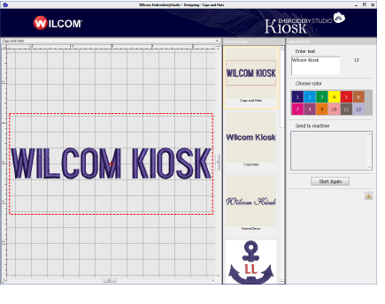

# Lettering Kiosk

EmbroideryStudio provides an easy-to-use Kiosk capability for cap and other embroidery. The lettering kiosk is primarily intended for use at retail outlets where fast and simple personalization of standard design layouts is required in consultation with customers.

The benefits to retail staff are:

- Minimal training time
- Minimal production errors
- Improved customer satisfaction
- Increased productivity
- Easy configuration for changing requirements
- Support for several brands of machine
- Simplicity of kiosk mode together with full embroidery lettering capabilities for supervisors.

The lettering kiosk provides a set of predefined design layouts and the ability to easily personalize them by modifying text and color. You can create your own layouts as well. Designs can be sent to machine from the kiosk via a single button press.

## Related topics...

- [Operations summary](Operations_summary)
- [Operating modes](Operating_modes)
- [Configuration options for supervisors](Configuration_options_for_supervisors)
- [Creating custom design layouts](Creating_custom_design_layouts)
