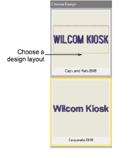
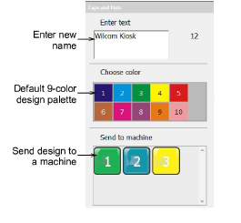
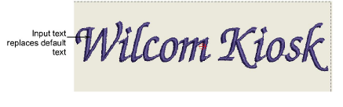
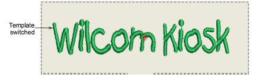

# Normal Kiosk operation

Once in kiosk mode, typical operation will flow as follows.

## To operate the kiosk...

- Choose a design layout from prepared templates in the left panel.

- Enter a new name in the text field and press Enter.

This text automatically replaces default text. By default, a maximum of 16 characters is allowed.

- Click in design window and zoom in / out by the following means:
- Press 1 for actual size.
- Press 0 to show all.
- Use the mouse scroll wheel to zoom.
- Click Start Again to return to default view.
- Choose a thread color from the list of available colors.

You can switch layouts and colors as desired and text will be preserved.

- When you are satisfied with the design, press a Send to Machine button. A separate button is present for each machine configured on the system.
- Press Start Again to create another design. The current design is automatically saved to the watching folder with a filename equal to text name.

Note: If the operator does not press Start Again but instead selects a new design layout, the new design overrides the current one, preserving any typed text.

- To exit kiosk mode altogether, press the lock icon. Normally you are prompted for a supervisor password.

## Related topics...

- [Set up machine connections](Set_up_machine_connections)
- [Configuration options for supervisors](Configuration_options_for_supervisors)
