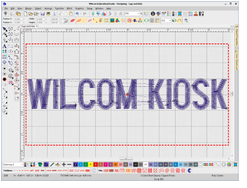
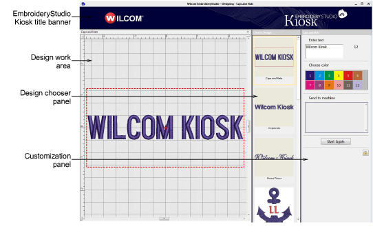
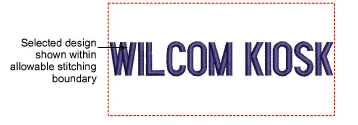

# Screen modes

In Wilcom Workspace mode, supervisors can use the full range of software capabilities to fine-tune settings. All adjustments can be saved to a template ready for use when the software is run in kiosk mode. Onscreen help is available via the Help menu.

## Kiosk screen mode

A password configuration setting allows supervisors to bypass the EmbroideryStudio screen and run the software in kiosk mode by default. Operators normally work in this screen and never need to leave it. In fact, they cannot exit without, optionally, a supervisor password.

Kiosk mode includes a 56-color default palette together with a number of packaged designs. However, in practice you will want to limit the palette to the colors available on your machines. The screen is divided into three functional areas apart from the banner at the top.

## Choose design panel

The Choose Design panel is positioned on the left side. It contains a set of predefined design layouts to choose from. It is easily extensible with other supervisor-created designs.

## Working design area

A working design area in the middle is optimized for 1366 x 768 resolution. It includes a dotted line indicating the maximum stitching boundary.

## Customization panel

The customization panel on the right allows the operator to easily customize designs by changing color and text of the selected layout. The supervisor can pre-configure the number and values of standard colors to match the thread color setup on the machines. Custom designs can be sent to one of several attached embroidery machines.

## Send to machine

Machines are pre-configured by the supervisor – typically up to 6\. Color-coded buttons easily identify machine by number and machine name. The supervisor can set color-coded icons for each machine brand. For example:

- Brother - Cyan
- Barudan - Navy Blue
- SWF - Red
