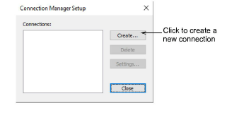
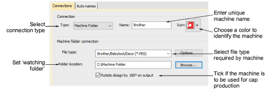
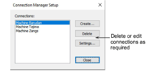
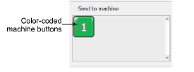

# Set up machine connections

Connection Manager allows you to connect to most later model machines. These machines often require files to be placed in a specific network location or ‘watching folder’. Once set up in EmbroideryStudio, a single click from the kiosk is sufficient to send the design to machine. Each configured machine:

- has a unique name and assigned button
- has a unique folder to which designs can be sent so they can be accessed from the machine control panel or third-party connection software.

## To set up machine connections...

1Select Setup > Connection Manager Setup.

2Click Create to set up a connection. The Connection Settings dialog opens.

3Make sure the connection type is set to ‘Machine Folder’. Watching folders should already have been set up for each machine on the network.

4Enter a unique machine name – e.g. ‘Brother PR600 Mach 1’.

5Choose a colored icon from the droplist to identify the machine in kiosk mode.

6Select the file type required by the machine. Each machine type uses a different file format:

| Machine | Format |
| ------- | ------ |
| Brother | PES    |
| SWF     | DST    |
| Barudan | U??    |

7If the file type requires it – e.g. PES – click the Options button to preset file options such as version type.

8Enter or browse to a folder location on the network or PC which has been set up for the specific machine. When you output a design, Connection Manager saves it to this folder in the specified file format.

9If the machine is intended for cap designs, tick the Rotate design by 180° option.

10Click OK when complete.

11Repeat as many times as you have machines to connect. Connections can be edited or removed at any time.

New machine connections appear as prominent buttons in the customization panel of the kiosk.

