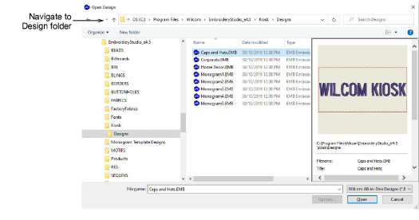
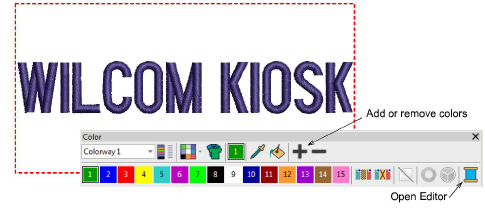
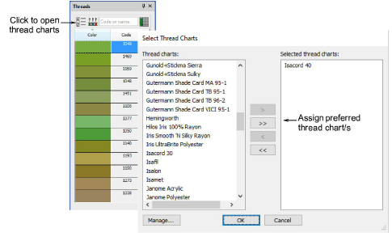
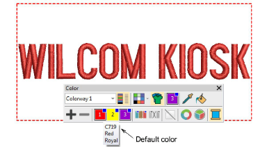

# Set up thread colors

|              | Use Standard > Open to open an existing design.                                                |
| ---------------------------------------- | ---------------------------------------------------------------------------------------------- |
|  | Use Standard > Save Design to save the current design. Right-click to open the Save As dialog. |

Thread colors are set up for each design layout. All three sample designs need to be edited according to the requirements of your machine setups.

## To set up thread colors...

1. Click the Open icon. The Open Design dialog opens.

2. Navigate to the Designs folder of your EmbroideryStudio e4 installation:

C:\\Program Files\\Wilcom\\EmbroideryStudio_e4.0\\Kiosk\\Designs

Alternatively, specify your own folder.

3. Select a design to edit and click Open.

4. Use the Color Palette tools to add or remove colors according to the thread setup on your machine/s.

5. Open the Threads docker and select your thread chart.

6. Assign threads to the palette with the Match All button. Alternatively, select threads corresponding to the thread setup on your machine, and assign these. The design layout defaults to the first color in the palette. The tooltip tells you the corresponding thread of each color.

7. Click Save to save the file in the design folder. The modified palette for this design will appear in the kiosk when you next run it.

## Related topics...

- [Change design location](Change_design_location)
