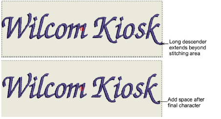

# Troubleshooting long descenders

Some characters may extend slightly beyond the allowable stitching area. This usually happens with script fonts or characters with long descenders or ascenders such as the ‘k’ in this example. This problem is easily fixed by adding a space after the final character.

