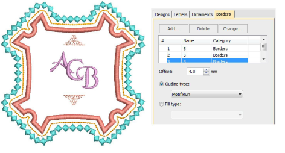
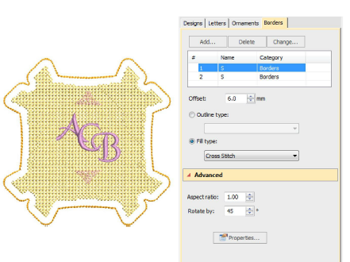

# Add multiple borders

Add up to four borders to the selected monogram. Use the Offset field to adjust margins between multiple borders. The software lets you enter a negative offset. This allows you to create multiple overlapping borders.

Use the Stitch Type buttons to change to line or fill stitch type for selected borders. Satin Line is the default stitch type. All line and fill stitch types available in the software can be used as borders. Click the Properties button to make further adjustments.

Remember, if you want to recolor monogram elements, you can select them individually without breaking apart the monogram. Simply hold down Alt and click the object.

## Related topics...

- [Change borders](Change_borders)
- [Adjust border shape & offset](Adjust_border_shape_offset)
