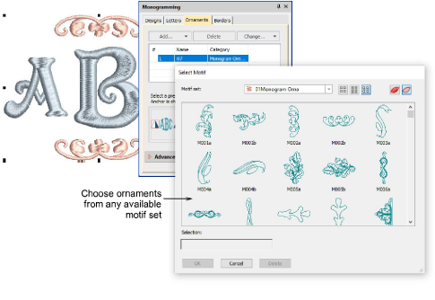
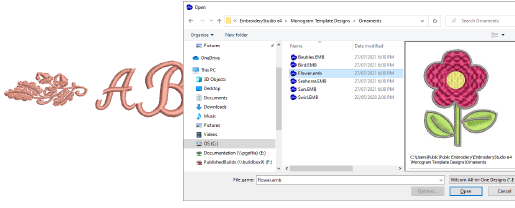
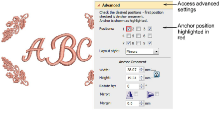

# Add ornaments

You can add up to ten ornament sets to a monogram design and change them at any time. Any available motif set can be used.

A set of ornamental designs is also available. These are stored in their own Ornaments folder.

Use the checkboxes to add up to eight instances of a selected ornament. These are arranged according to ornament placements relative to the lettering.

The first selected serves as the ‘anchor’ position (highlighted in red). All other ornaments are sized, rotated and mirrored in relation to it. Use the Width and Height fields to change ornament dimensions. The Lock Aspect Ratio toggle forces width and height to maintain their proportions. Use the Margin setting to offset ornaments from the lettering.

## Related topics...

- [Modify ornaments](Modify_ornaments)
- [Create single ornament layouts](Create_single_ornament_layouts)
- [Multi-ornament layouts](Multi-ornament_layouts)
