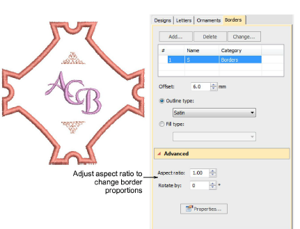
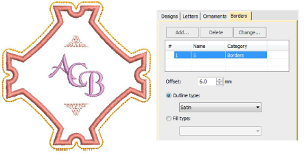
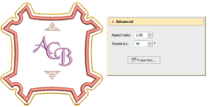

# Adjust border shape & offset

Use the Aspect Ratio settings to adjust height and width proportions.

Use the Offset field to fine-tune margins between lettering and border, and between border and border.

Use the Rotate field to re-orientate the border as desired.

## Related topics...

- [Adjust border shape & offset](#XREF_17482_Adjusting_border)
- [Add multiple borders](Add_multiple_borders)
