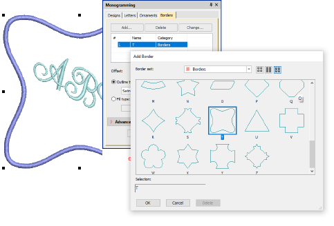

# Change borders

If you are using one of the template designs, it is a simple matter to change borders. Use the Change button on the Borders tab to select from one of the many available.

## Related topics...

- [Change borders](#XREF_63210_Modifying_borders)
- [Adjust border shape & offset](Adjust_border_shape_offset)
- [Add multiple borders](Add_multiple_borders)
