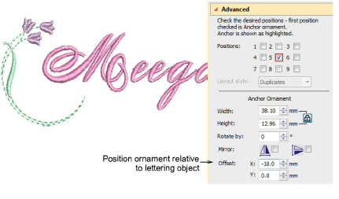

# Create single ornament layouts

Use Position #5 to insert an ornament as a standalone component within a set. All other checkboxes are unchecked automatically. Width, Height, and Rotate By fields and Mirror checkboxes remain available, and Offset controls replace the Margin control.

Use the X and Y fields in the Offset panel to position the ornament horizontally or vertically relative to the lettering object. These settings specify the position of the ornament center relative to the center of the lettering object.

## Related topics...

- [Modify ornaments](Modify_ornaments)
- [Add ornaments](Add_ornaments)
- [Multi-ornament layouts](Multi-ornament_layouts)
