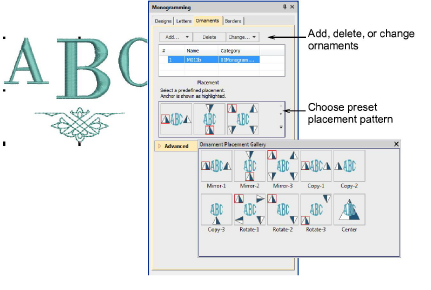
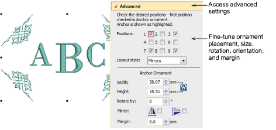

# Modify ornaments

If you are using a template design or adapting another monogram, it is a simple matter to change the ornament to a different type or configuration. Use the buttons at the top of the Ornaments tab to add, delete, or change ornaments.

Choose from a range of preset placement patterns, including Mirrors, Duplicates, and Cycle. Note that the pyramid icon indicates not only the placement but also the orientation of the pattern in both horizontal and vertical planes.

If the preset pattern gallery doesn’t quite give you what you are looking for, open the Advanced panel. These settings give you precise control over ornament placement, size, rotation, orientation, and margin.

## Related topics...

- [Add ornaments](Add_ornaments)
- [Create single ornament layouts](Create_single_ornament_layouts)
- [Multi-ornament layouts](Multi-ornament_layouts)
