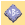

# Monogram borders

|  | Use Toolbox > Monogramming to create personalized monograms using a selection of predefined monogramming styles, border shapes and ornaments. |
| ------------------------------------------------------ | --------------------------------------------------------------------------------------------------------------------------------------------- |

You can add up to four borders of the same shape to a monogram design.

## Related topics...

- [Adjust border shape & offset](Adjust_border_shape_offset)
- [Add multiple borders](Add_multiple_borders)
