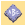
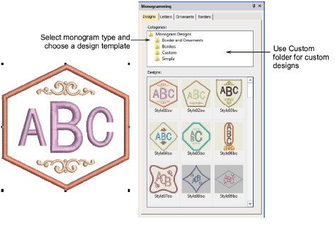
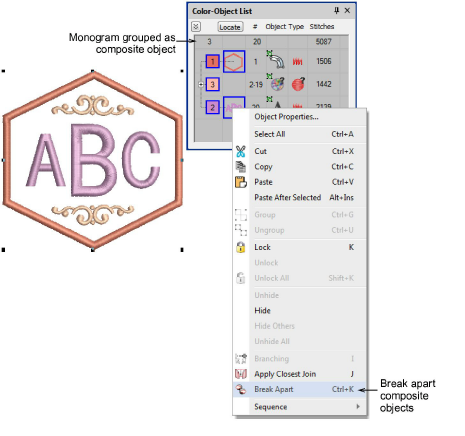
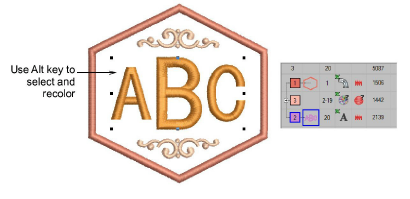
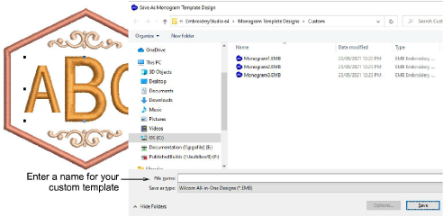

# Monogram designs

|  | Use Toolbox > Monogramming to create personalized monograms using a selection of predefined monogramming styles, border shapes and ornaments. |
| -------------------------------------------- | --------------------------------------------------------------------------------------------------------------------------------------------- |

You build monograms using the Monogramming docker. The simplest way to get started is to select a monogram template from the Designs tab. This tab gives you a selection of design templates ranging from lettering only, with borders or with ornaments. The Custom folder contains your custom templates. Select a design template from the display panel and modify as required via the other tabs.

Note that the monogramming design is grouped in the Color-Object List docker. It is treated as a single, composite object. It can only be edited via the Monogramming docker. It cannot be ungrouped but it can be broken apart into its components. [See also Breaking apart lettering.](../lettering_edit/Breaking_apart_lettering)

However, if all you want to do is recolor monogram elements, you can select them individually without breaking apart the monogram. Simply hold down Alt and click the object.

If you want to save a design as a template for future use, use the File > Save as Monogram Template command. The dialog opens onto the Custom monogram designs folder. When you save here, the design will appear in the Designs tab under the Custom folder.

## Related topics...

- [Monogram lettering](Monogram_lettering)
- [Monogram ornaments](Monogram_ornaments)
- [Monogram borders](Monogram_borders)
