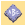
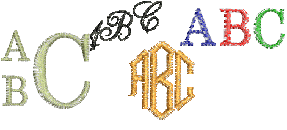
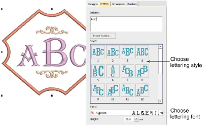
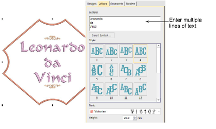
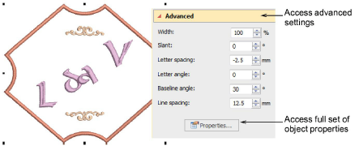

# Monogram lettering

|  | Use Toolbox > Monogramming to create personalized monograms using a selection of predefined monogramming styles, border shapes and ornaments. |
| ------------------------------------------------------ | --------------------------------------------------------------------------------------------------------------------------------------------- |

The Letters tab of the Monogramming docker allows you to create personalized monograms with initials, including special characters and symbols, or unlimited lines of characters.

The Letters tab provides similar options to the Lettering tab of the Object Properties docker. If you are using one of the template designs, the easiest way to adapt it is to apply a different style. Change initials as required and choose from any number of native embroidery fonts or any TrueType font installed on your system. In addition, this tab provides a selection of styles to choose from.

In place of single letters, the same tab allows you to enter multiple lines.

If a selected style doesn’t quite give you what you are looking for, open the Advanced panel to access more settings. Use these to adjust letter width, spacing, etc. Adjust letter rotation and baseline angle. These allow you rotate individual letters or the entire baseline.

Click Properties to make any further adjustments – e.g. stitch type. The default values for monogram lettering are different from those for conventional lettering. All settings can, however, be controlled via the Object Properties docker. [See also Create lettering with object properties.](../lettering_create/Create_lettering_with_object_properties)

## Related topics...

- [Monogram lettering](#XREF_48014_Monogram_lettering)
- [Monogram ornaments](Monogram_ornaments)
- [Monogram borders](Monogram_borders)
