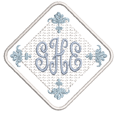

# Monogramming

A monogram is a design composed of one or more letters, typically the initials of a name, used as an identifying mark. The Monogramming feature offers a simple way to create personalized monograms using a selection of predefined monogramming styles, border shapes and ornaments, together with a set of tools to help you place these elements in creative and decorative ways.

This section details the creation of monogram lettering with initials or with a name, how to add ornaments to monograms, and how to create ornament layouts.

## Related topics...

- [Monogram designs](Monogram_designs)
- [Monogram lettering](Monogram_lettering)
- [Monogram ornaments](Monogram_ornaments)
- [Monogram borders](Monogram_borders)
