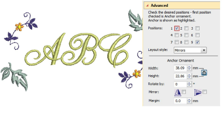

# Multi-ornament layouts

You can add up to eight instances of a selected ornament to your monogram. Any combination of ornaments and ornament positions can be used. Add the ornament sets you want and assign placements to each one.

Remember, if you want to recolor monogram components, you can select them individually without breaking apart the monogram. Simply hold down Alt and click the object.

## Related topics...

- [Modify ornaments](Modify_ornaments)
- [Add ornaments](Add_ornaments)
- [Create single ornament layouts](Create_single_ornament_layouts)
