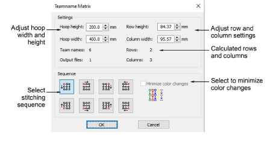
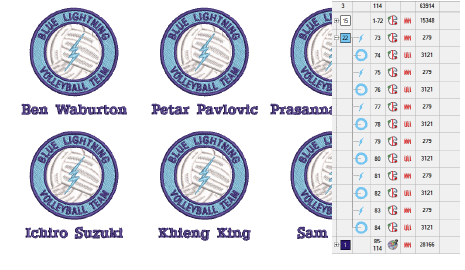

# Create a matrix of designs

|  | Use Team Names docker > Teamname Matrix to automatically create a matrix of all names in a teamname object together with their corresponding design. |
| ---------------------------------------------------------- | ---------------------------------------------------------------------------------------------------------------------------------------------------- |

The Teamname Matrix function allows you to create a matrix of names optimized for batch stitching. Minimize the number of color changes created by the matrix operation.

## To create a matrix of designs...

1. Open a teamname design.

2. Select everything you want to include and click the Teamname Matrix icon in the Teamname List tools.

The number of rows and columns in the matrix are automatically calculated according to number of team names, row and column height settings, and the physical area of the hoop. More than one hooping may be calculated.

3. Adjust height and width settings to match the intended hoop.

4. Adjust row height and column width to set the gap for most efficient stitchout.

Increase settings if you want to enlarge the gap between designs. Calculated fields are updated, including number of rows/columns and output files.

5. Select a Sequence option. Each option indicates a possible stitching sequence for the entire matrix.

6. Optionally, select the Minimize Color Changes checkbox. When selected, the entire matrix is resequenced by color.

7. Click OK. A new file is created containing the number of team names that will fit into the specified hoop – i.e. number of rows multiplied by number of columns. If needed, another file is created to accommodate additional names. The Output Files field indicates the total number of files.

## Related topics...

- [Create separate designs](Create_separate_designs)
- [Output teamname designs](Output_teamname_designs)
