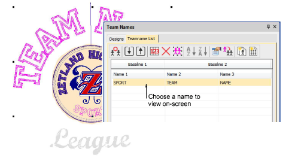

# Create custom templates

Typically, you will receive a brief and possibly artwork from a customer. Before you even import the names, you may prefer to mock up the design for approval purposes. This same design can then be saved as a teamname template.

## To create a custom template...

1Import any artwork needed for your template.

2Add any lettering elements you want to use. Include any ‘static’ elements which won’t change in the eventual teamname design.

3Optionally, give generic names to any text which will form part of the eventual teamname design – ‘TEAM NAME’.

4Select any lettering that is to remain static – e.g. ‘Zetland Highshool’ – and lock by pressing the K shortcut. When the template is opened, the locked text will be excluded from the teamname object.

5Select File > Save As Teamname Template, enter a name for the layout – e.g. ‘Zetland High’ – and click OK. The dialog opens onto the Custom teamname templates folder. When you save here, the design will appear in the Designs tab under the Custom folder.

6To test your template, open a new design tab and click the Team Names icon to access the docker. Go to Designs > Custom to locate your template. Once opened, the unlocked text will be interpreted as a teamname object.

7Edit the text as you would any other teamname template.

## Related topics...

- [Creating simple teamname designs](Creating_simple_teamname_designs)
- [Use templates with teamname designs](Use_templates_with_teamname_designs)
