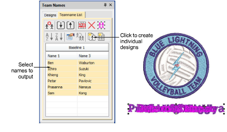

# Create separate designs

|  | Use Toolbox or Docker > Team Names to add/remove team members and edit individual names. |
| ------------------------------------------------ | ---------------------------------------------------------------------------------------- |

You can create individual designs from each name in a teamname design.

## To create separate designs...

1. Open a design and click the Team Names icon. By default all member names are selected.

2. Select names to output – click Select All or use Ctrl and Shift keys to selectively choose.

3. To create individual embroidery designs for each team member, click Create Designs. Designs are generated for each name. The name is now a normal lettering object.

4. Save each design out individually.

## Related topics...

- [Create a matrix of designs](Create_a_matrix_of_designs)
- [Output teamname designs](Output_teamname_designs)
