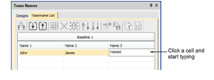
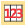
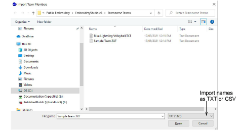
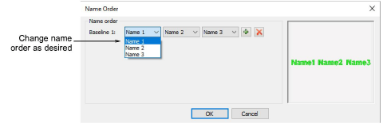
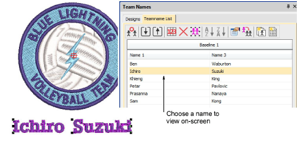

# Create teamname objects

|  | Use Toolbox or Docker > Team Names to associate multiple names with a design. |
| -------------------------------------- | ----------------------------------------------------------------------------- |

To associate team members with a design, you create a variable ‘teamname object’. Either key in the names of the team members directly, or import from a list provided by the customer.

## To create a teamname object...

- Open the design you want to use.

- Click the Team Names icon to access the docker. By default, the teamname object will consist of a single baseline with three names.

- If you are happy with the default layout, simply click a cell and start typing. Press Tab or Shift+Tab to move back and forth through name fields.
- Alternatively, use the Teamname List tools to add names, delete names, etc:

| Tool                                             | Function            |                                                                                                     |
| ------------------------------------------------ | ------------------- | --------------------------------------------------------------------------------------------------- |
|        | Manage Teams        | Manage teams and team members for future use. See below.                                            |
|    | Import Team Members | Import or export a list of team members in either TXT or CSV format. Names must be comma delimited. |
|    | Export Team Members |                                                                                                     |
|            | Name Order          | Change default naming order or include/exclude names as required.                                   |
|                  | Remove Selected     | Delete selected rows or the entire member list.                                                     |
|            | Select All          | Select all list members for modification or positioning.                                            |
|    | Sort Ascending      | Sort a selected column in ascending or descending order.                                            |
|  | Sort Descending     |                                                                                                     |

- Optionally, click the Import Team Members button to import team members from a list possibly provided by the customer. The list must be comma delimited.

::: tip
When you import a teamname list you can import it from anywhere. However, you cannot use the Manage Teams dialog effectively with it unless it is saved in the ‘Teamname Teams’ system folder. [See Managing teams for details.](Managing_teams)
:::

- Click the Name Order button if you want to change the default naming order. Use it, for example, to put surnames first or limit which names are included – e.g first and third.

- Click OK and enter reference points as prompted.

- Select all names and select Stitch > Generate Stitches or press G.
- Select names one-by-one to view them in the design.

## Related topics...

- [Managing teams](Managing_teams)
- [Teamname templates](Teamname_templates)
- [Apply baselines](../lettering_create/Apply_baselines)
