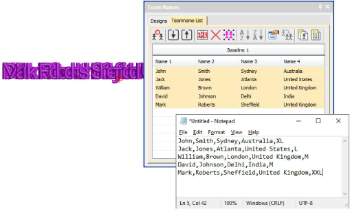
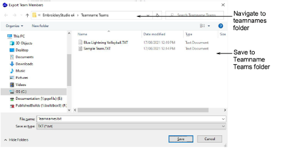
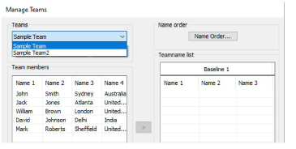

# Import teamname lists with additional fields

|  | Use Team Names > Import Team Members to import a list of team members in either TXT or CSV format. Names must be comma delimited. |
| -------------------------------------------------------- | --------------------------------------------------------------------------------------------------------------------------------- |
|      | Use Team Names > Manage Teams to manage teams and team members for future use.                                                    |

A ‘size’ field is often added to teamname lists even though it does not form part of the design. While the size field doesn’t appear in the design, it is added to each design name when generated. This allows machinists to ensure they are using the right size garment for the specified name.

To view size fields in the Manage Teams dialog, first save the teamname file in CSV or TXT format to the Teamname Teams folder as shown. Don’t use sub-folders.

Open the Manage Teams dialog and select the file name from the Teams droplist. All fields will be imported...

