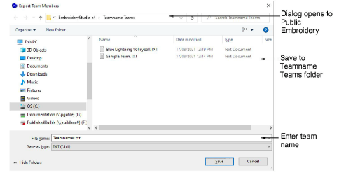
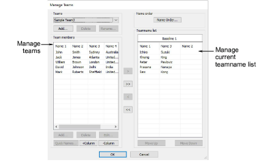
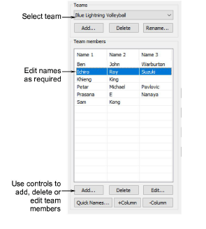
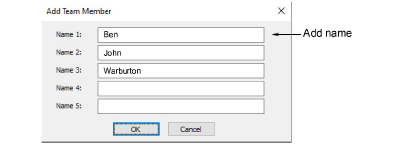
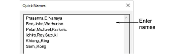
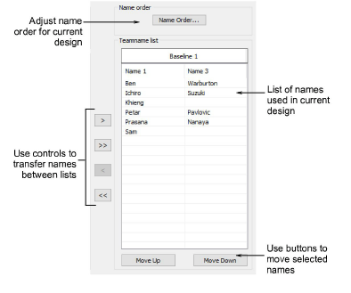
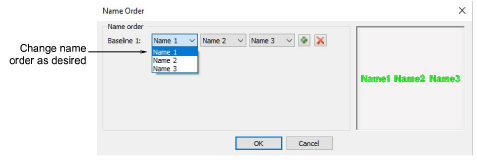

# Managing teams

|          | Use Toolbox or Docker > Team Names to associate multiple names with a design.                      |
| -------------------------------------------------------- | -------------------------------------------------------------------------------------------------- |
|  | Use Team Names > Export Team Members to export a list of team members in either TXT or CSV format. |
|      | Use Team Names > Manage Teams to manage teams and team members for future use.                     |

A teamname object may contain all names in a given team, or a subset of those names. You can even combine members from different teams.

## To manage teams...

- Open a teamname design and click the Team Names icon. By default all names are selected.
- To save a team for future use, click the Export Team Members icon in the Teamname List. The dialog will open onto a public folder containing all your teams – a single file, either TXT or CSV, for each team.

- Click the Manage Teams icon to access the dialog. The Team Members panel will default to the last opened team.

- To view the team you have just exported, select from the Teams droplist.

- Use the +Column or \-Column buttons to establish the number of names for each team member – the default is three (3).
- Select names to associate with the design. To select multiple names, hold down Ctrl or Shift as you select.
- Edit the list as necessary by means of Delete and Edit buttons.
- Add team members one-by-one or as a group:
- To add a single name, click Add in the Team Members panel.

- To add a group of names, click Quick Names. Enter names in the format Name 1, Name 2, Name 3.

::: tip
You can type in the names, or paste them in from a text file. Each name must be separated by a comma. There is no need for a space.
:::

- Click OK. The new names are added to the Team Members list.
- Transfer names, selectively or all together, to the Teamname list using the arrow buttons. You can even transfer names from different teams to the same list.

- Edit the list as desired:
- Sort names alphabetically by column.
- Sequence names – this will determine their stitching order.
- Remove names from the list.
- Click the Name Order button if you want to change the default naming order. Use it, for example, to put surnames first or limit which names are included – e.g first and third.

