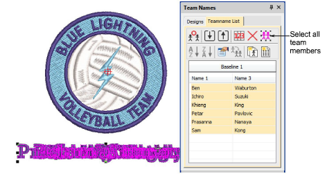
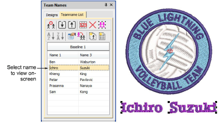
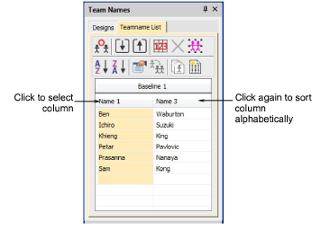
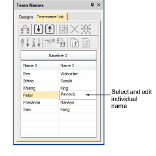
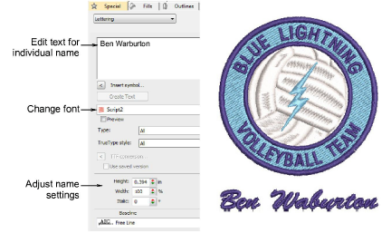

# Modifying teamname designs

|  | Use Toolbox > Team Names to add/remove team members and edit individual names. |
| ------------------------------------------------ | ------------------------------------------------------------------------------ |
|            | Right-click Toolbox > Lettering to edit lettering on-screen.                   |

You can preview individual team names as they will be stitched out. Add or delete names, sort teamname lists, and change properties of team members. Set properties such as font, size or color for each name. You can also set properties for an entire column of names.

## To modify a teamname design...

- Open a teamname design and click the Team Names icon. By default all names are selected.

- Adjust positioning of the teamname group as desired.

- View team names in any of the following ways:
- Select a name.
- Use arrows keys to scroll up and down the list to view each name in turn.

- Click list header to select a column of names – use Sort buttons to sort lists in ascending or descending alphabetical order.

- Click a cell to select an individual name in the Teamname List.

- Edit selected names on-screen as you would any other lettering object – e.g. adjust letter kerning.
- Adjust lettering baselines as you would any other lettering object. For example, select an ‘auto-frame’ style for fixed line baselines.
- Use the Teamname List tools to add names, delete names, change properties, as required:

| Tool                                                       | Function          |                                                                                        |
| ---------------------------------------------------------- | ----------------- | -------------------------------------------------------------------------------------- |
|        | Manage Teams      | Manage teams and team members for future use.                                          |
|                  | Remove            | Delete selected rows or the entire member list.                                        |
|            | Select All        | Select all list members for modification or positioning.                               |
|    | Sort Ascending    | Sort a selected column in ascending or descending order.                               |
|  | Sort Descending   |                                                                                        |
|        | Object Properties | Edit properties of selected rows, columns or all list members.                         |
|                    | Apply to All      | Copy one team member’s properties to all members.                                      |
|              | Create Designs    | Create individual designs for each member.                                             |
|            | Teamname Matrix   | Create a matrix of all teamname designs, sequenced for efficient stitchout. See below. |

- To view and/or edit member properties, click Object Properties.

::: tip
By default a space is inserted between names. To remove this space, set the Word Spacing value in the Layout dialog to 0%.
:::

## Related topics...

- [Creating simple teamname designs](Creating_simple_teamname_designs)
- [Adjust spacing settings](../lettering_create/Adjust_spacing_settings)
- [Editing Embroidery Lettering](../lettering_edit/Editing_Embroidery_Lettering)
- [Adjust fixed-width baseline settings](../lettering_edit/Adjust_fixed-width_baseline_settings)
