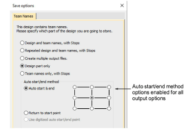
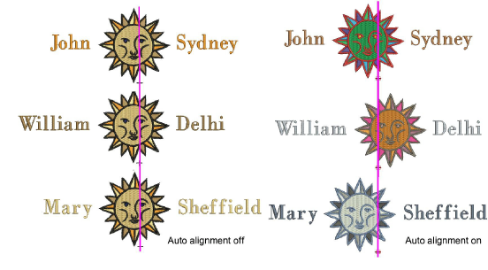

# Output teamname designs

When you output a teamname design, you need to define how it is to be generated as a machine file. You can generate files that include:

- Both design and names in a single file
- Design in one file and names in another, or
- Individual files for each name plus design.

You set these options whenever you save the file in machine format or output directly to machine.

## Access output options

You access the Save Options > Team Names dialog in any of these ways:

- Select File > Export Machine File, choose a machine file format – e.g. DST – from the Save as type droplist, and click Options.
- Select File > Record in Database, choose a machine file format – e.g. DST – from the Save as type droplist, and click Options.
- Select Legacy Features > Disk > Save As > Options.
- Select Legacy Features > Send to Machine Manager > Options.
- Select Legacy Features > Send to Stitch Manager > Options.
- Select File > Send to Connection Manager > Options.

## Output options

The following output options are available to you:

| Option                                     | Function                                                                                                                                                                                                  |
| ------------------------------------------ | --------------------------------------------------------------------------------------------------------------------------------------------------------------------------------------------------------- |
| Design and team names, with Stops          | Creates a single machine file including one copy of the design and all names. Stops are inserted after the design, and between the names – i.e. Design Stop TeamMember1 Stop TeamMember2 Stop, etc.       |
| Repeated design and team names, with Stops | Creates a single machine file with multiple copies of the design, and all names. Stops are inserted after each static design/name combination – e.g. Design + TeamMember1 Stop Design + TeamMember2 Stop. |
| Create multiple output files               | Creates separate files for each name, each of which includes a copy of the static part of the design. When stitching to ES Machine Manager, each file is queued separately.                               |
| Design part only                           | Creates a file containing only the static part of the design.                                                                                                                                             |
| Team names only, with Stops                | Creates a single file containing only the names, separated by stops. This means that after each machine stop, you can change frames.                                                                      |

## Available centering methods

The Auto Start and End feature is available to specify first and last stitches in a design. This makes it easy to position the needle before stitching, and reduces the chance of the needle hitting the side of the frame.

| Method                             | Description                                                                                                                                                                                                                            |
| ---------------------------------- | -------------------------------------------------------------------------------------------------------------------------------------------------------------------------------------------------------------------------------------- |
| Auto Start and End                 | Auto Start and End is automatically turned on during Team Names output, defaulting to Center-Center. Select one of the nine preset end points.                                                                                         |
| Return to Start Point              | Creates a connecting stitch from the end point to the start point.                                                                                                                                                                     |
| Use Digitized Auto Start/End Point | This option is primarily used with multi-decoration designs where you want to strictly define the start/end point of the embroidery component. It is only available if there are already digitized start and end points in the design. |

The trouble comes when you try to set a common start and end point for team names.

Teamname designs, however, can be stitched in a consistent location on the garment irrespective of name length. Select either output option:

- ‘Repeated design and team names, with Stops’, or
- ‘Team names only, with Stops’.

And select one of the nine Auto Start and End preset end points.

The purpose of auto-alignment is to allow ‘name frame’ layouts and optional repeated designs to be stitched in a consistent location on the garment where names are of varying lengths.

## Related topics...

- [Send designs to Stitch Manager](../../Production/output/Send_designs_to_Stitch_Manager)
- [Setting auto start & end](../../Production/hoops/Setting_auto_start_end)
