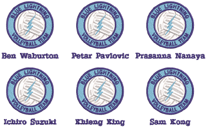

# Outputting teamname designs

You can create individual designs from each name in a teamname design. Alternatively, you can create a matrix of names optimized for batch stitching.

For output, you can generate machine files consisting of:

- Both design and names
- Design in one file and names in another, or
- Design and names in individual files.

## Related topics...

- [Create separate designs](Create_separate_designs)
- [Create a matrix of designs](Create_a_matrix_of_designs)
- [Output teamname designs](Output_teamname_designs)
