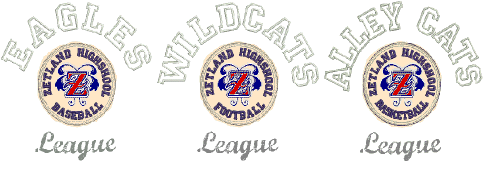

# Team Names

The Team Names feature lets you create designs with multiple names. For example, you can use the same logo with different names for sports teams or corporate uniforms, without having to create multiple copies of the same design. Depending on how you want to stitch out, you can choose to save and stitch names and designs separately, or together.

This section shows you how to set up teams and create teamname designs. It also describes how to modify teamname designs and output them in a variety of ways.

## Related topics...

- [Creating simple teamname designs](Creating_simple_teamname_designs)
- [Teamname templates](Teamname_templates)
- [Modifying teamname designs](Modifying_teamname_designs)
- [Managing teams](Managing_teams)
- [Outputting teamname designs](Outputting_teamname_designs)
